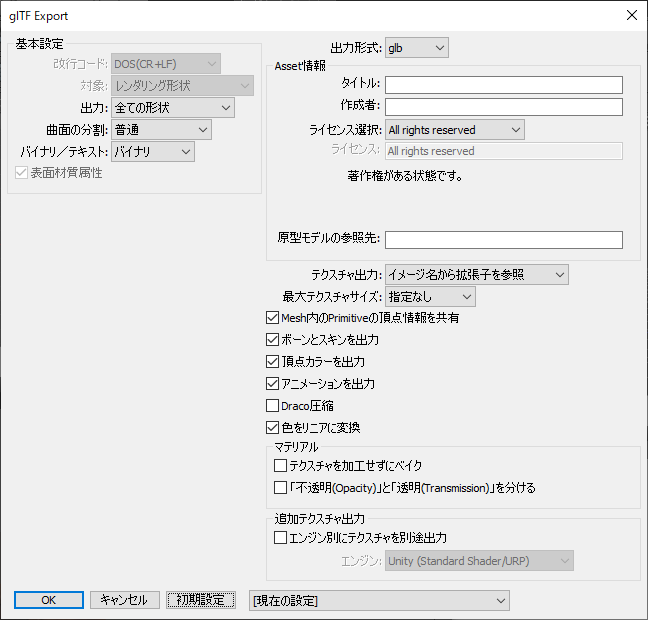
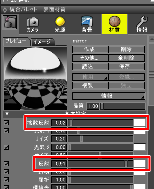

# glTF Converter for Shade3D

Shade3DでglTF(拡張子 gltf/glb)をインポート/エクスポートするプラグインです。  
glTFの処理で、「Microsoft glTF SDK」( https://github.com/Microsoft/glTF-SDK )を使用しています。    
圧縮処理で、「draco」 ( https://github.com/google/draco ) を使用しています。    

## 機能

以下の機能があります。

* glTF 2.0の拡張子「gltf」「glb」の3D形状ファイルをShade3Dに読み込み (インポート)
* Shade3DのシーンからglTF 2.0の「gltf」「glb」の3D形状ファイルを出力 （エクスポート）
* glTFエクスポート時に、Unity/Unigine用のテクスチャを別途出力する機能 (ver.0.2.5.0 -)

## 動作環境

* Windows 7/8/10以降のOS    
* macOS 10.11以降   
* Shade3D ver.16/17以降で、Standard/Professional版（Basic版では動作しません）  
  Shade3Dの64bit版のみで使用できます。32bit版のShade3Dには対応していません。   

## 使い方

### プラグインダウンロード

以下から最新版をダウンロードしてください。  
https://github.com/ft-lab/Shade3D_GLTFConverter/releases

### プラグインを配置し、Shade3Dを起動

※ glTF Converter ver.0.2.0.0以降で「MotionUtil」プラグインが必要となりました。    
「MotionUtil」( https://github.com/ft-lab/Shade3D_MotionUtil )は、Morph Targetsやモーション処理のユーティリティプラグインです。    
「MotionUtil」プラグインバイナリは、https://github.com/ft-lab/Shade3D_MotionUtil/releases より最新版をダウンロードするようにしてください。    

Windowsの場合は、ビルドされた glTFConverter64.dllとMotionUtil64.dll をShade3Dのpluginsディレクトリに格納してShade3Dを起動。  
Macの場合は、ビルドされた glTFConverter.shdpluginとMotionUtil.shdplugin をShade3Dのpluginsディレクトリに格納してShade3Dを起動。  
メインメニューの「ファイル」-「エクスポート」-「glTF(glb) Shade3D Material」が表示されるのを確認します。  

### 使い方

Shade3Dでのシーン情報をエクスポートする場合、  
メインメニューの「ファイル」-「エクスポート」-「glTF(glb) Shade3D Material」を選択し、指定のファイルにgltfまたはglb形式でファイル出力します。  
ファイルダイアログボックスでのファイル指定では、デフォルトではglb形式のバイナリで出力する指定になっています。   
WIn環境の場合はここで拡張子を「gltf」にすると、テキスト形式のgltfファイル、バイナリデータのbinファイル、テクスチャイメージの各種ファイルが出力されます。  

gltf/glbの拡張子の3DモデルデータをShade3Dのシーンにインポートする場合、   
メインメニューの「ファイル」-「インポート」-「glTF(gltf/glb) Shade3D Material」を選択し、gltfまたはglbの拡張子のファイルを指定します。  

## サンプルファイル

サンプルのShade3Dのファイル(shd)、エクスポートしたglbファイルを https://ft-lab.github.io/gltf.html に置いています。    

## glTF入出力として対応している機能

* メッシュ情報の入出力
* シーンの階層構造の入出力
* マテリアル/テクスチャイメージとして、BaseColor(基本色)/Metallic(メタリック)/Roughness(荒さ)/Normal(法線)/Emissive(発光)/Occlusion(遮蔽)を入力
* マテリアル/テクスチャイメージとして、BaseColor(基本色)/Metallic(メタリック)/Roughness(荒さ)/Normal(法線)/Emissive(発光)/Occlusion(遮蔽)を出力
* マテリアルのバンプマップは法線マップに変換して出力 (ver.0.2.4.2 -)
* アニメーション要素として、ボーン、ボールジョイントやスキン情報の入出力
* ポリゴンメッシュの頂点カラーの入出力 (頂点カラー0のみ) ver.0.1.0.3で追加。    
頂点カラーとしてRGBAの要素を使用しています。
* テクスチャマッピングの「アルファ透明」の入出力。ver.0.1.0.4で追加。  
* 表面材質の「透明」の入出力。ver.0.1.0.13で追加。    
* ボーン/ボールジョイントを使用したスキンアニメーション情報の入出力。ver.0.1.0.6で追加。   
* Morph Targets情報の入出力。ver.0.2.0.0で追加。ただし、Morph Targetsを使用したキーフレームアニメーションはまだ未対応です。    
* ジオメトリのDraco圧縮。ver.0.2.0.2で追加。    
Draco圧縮はAnimation/Morph Targets/Texture Imageの圧縮には対応していません。
* マテリアルのunlit対応（Shade3Dの表面材質の「陰影付けしない」のチェックボックス）。ver.0.2.0.4で追加。
* Export : テクスチャマッピングの「不透明マスク」の出力。ver.0.2.1.0で追加。    
* AlphaMode(Opaque/Blend/Mask)の入出力。ver.0.2.1.1で追加。    
* AlphaCutoffの入出力。ver.0.2.1.1で追加。    
* エクスポート時に表面材質のマッピングで複数テクスチャ使用時のベイク対応。ver.0.2.2.0で追加。    
* エクスポート時に、「不透明(Opacity)」と「透明(Transmission)」を分けるオプション指定(KHR_materials_transmissionの対応)。ver.0.2.5.0で追加。    
* エクスポート時に、Unity/Unigine用のテクスチャを別途出力する機能。ver.0.2.5.0で追加。    
* エクスポート時に、KHR_materials_clearcoat/KHR_materials_sheenを出力。ver.0.2.5.0で追加。    
これは「DOKI for Shade3D」( http://www.ft-lab.ne.jp/shade3d/DOKI/ )のパラメータを参照しています。    

PBR表現としては、metallic-roughnessマテリアルモデルとしてデータを格納しています。  

### インポート時のdoubleSidedのマテリアルについて (ver.0.1.0.11 - )

インポート時にdoubleSidedの属性を持つマテリアルは、    
Shade3Dのマスターサーフェス名に「_doubleSided」が付きます。    
なお、Shade3DのレンダリングではdoubleSidedでなくても両面が表示されることになります。    

### エクスポート時のdoubleSidedの対応について

glTFフォーマットでは、デフォルトでは表面のみ表示されます。   
裏面は非表示となります。   
裏面を表示させるには、表面材質に割り当てるマスターサーフェス名にて「doublesided」のテキストを含めると、その表面材質はdoubleSided対応として出力されます。

### エクスポート時の「アルファ透明」の対応について (ver.0.1.0.4 - )

表面材質のマッピングレイヤとして、「イメージ/拡散反射」の「アルファ透明」を選択した場合、    
元のイメージがpngのAlpha要素を持つ場合に、透過処理(glTFのalphaMode:MASK)が行われます。    
     

この場合、エクスポート時のオプションで「テクスチャ出力」を「jpegに置き換え」としたときも、png形式で出力されます。

### エクスポート時の「透明」の対応について (ver.0.1.0.13 - )

表面材質の「透明」が0.0よりも大きい場合、    
「1.0 - 透明」の値がglTFのpbrMetallicRoughnessのbaseColorFactorのAlphaに格納されます。    
このとき、glTFのalphaMode:BLENDが使用されます。    

### エクスポート時のAlphaModeの指定について (ver.0.2.1.0 - )

表面材質の「情報」ポップアップメニューより「AlphaMode (glTF) Shade3D Material」を選択することで、    
glTFのalphaModeを指定できます。     
     

「AlphaMode」で「OPAQUE」は透過無しの指定になります。    
「BLEND」は表面材質の「不透明マスク」のテクスチャをマッピングすることにより、diffuseColorのAlphaチャンネルに任意のAlpha値を与えることができます。    
「不透明マスク」テクスチャを使用せずに「イメージ/拡散反射」の「アルファ透明」を使用することでも、同等の効果を出せます。    
「MASK」は、アルファ値によるマスクキング（トリミング）を行います。AlphaCutoffでマスクの敷居値を指定します。
デフォルトは0.5になります。    

### エクスポート時のボーン/ボールジョイントとスキンについて

GLTF/GLBエクスポート時に、ボーンとスキンを持つ形状の場合は、その情報も出力されます。   
ver.0.2.3.0でボールジョイントにも対応しました。    
このとき、Shade3Dの「シーケンス Off」としての姿勢で出力されます。  
なお、ver.0.1.0.0ではシーケンス On時の姿勢はエクスポートで出力していません。   

スキンのバインド情報は、ポリゴンメッシュの1頂点に対して最大4つまでです。   

### エクスポート時の出力をスキップする形状について

ブラウザでレンダリングをしない指定にしてる場合、形状名の先頭に「#」を付けている場合は、その形状はエクスポートされません。

### インポート/エクスポート時のボーンについて

ボーンで、変換行列に「せん断」「スケール要素」を与えると正しくインポート/エクスポートされません。    
ver.0.2.3.0でボーンの「回転」を持つ場合にも正しく出力できるようになりました。    
また、インポート時のアニメーション要素は、すべてボーンで表現されます。    

### エクスポートオプション

エクスポート時にダイアログボックスが表示され、オプション指定できます。   
自由曲面や掃引体/回転体などの分割は「曲面の分割」で精度を指定できます。    

「出力形式」はglb/gltfを選択できます (ver.0.2.1.0 追加)。    
バイナリで1ファイルにする場合はglb、テキスト形式とテクスチャファイルに分離して出力する場合はgltfを選択します。    
「テクスチャ出力」で「イメージから拡張子を参照」を選択すると、   
マスターイメージ名で「.png」の拡張子が指定されていればpngとして、   
「.jpg」の拡張子が指定されていればjpegとしてテクスチャイメージが出力されます。   
「テクスチャ出力」で「pngに置き換え」を選択すると、すべてのイメージはpngとして出力されます。   
「jpegに置き換え」を選択すると、すべてのイメージはjpgとして出力されます。   
ただし、テクスチャマッピングで「アルファ透明」を選択している場合は強制的にpng形式で出力されます。    
「最大テクスチャサイズ」の選択で、出力するテクスチャサイズが指定よりも大きい場合にリサイズして出力します (ver.0.2.0.2 追加)。    
「Mesh内のPrimitiveの頂点情報を共有」チェックボックスをオンにすると、    
glTFの1つのMeshに複数のPrimitiveを持つ構造の場合(フェイスグループ使用時)に、頂点情報（位置/法線/UV/頂点カラー/スキンのウエイト）を共有するようにします (ver.0.2.0.3 追加)。    
「ボーンとスキンを出力」チェックボックスをオンにすると、glTFファイルにボーンとスキンの情報を出力します。   
ファイルサイズを小さくしたい場合やポージングしたそのままの姿勢を出力したい場合はオフにします。   
「頂点カラーを出力」チェックボックスをオンにすると、ポリゴンメッシュに割り当てられた頂点カラー情報も出力します。    
「アニメーションを出力」チェックボックスをオンにすると、ボーン＋スキンのモーションを割り当てている場合にそのときのキーフレーム情報を出力します。    
「Draco圧縮」チェックボックスをオンにすると、ジオメトリデータを圧縮して出力します (ver.0.2.0.2 追加)。    
ただし、Draco圧縮はジオメトリのみの圧縮となり、Morph Targets/アニメーション/テクスチャイメージは圧縮されません。    
「色をリニアに変換」チェックボックスをオンにすると、拡散反射色/発光色/頂点カラーが逆ガンマ補正されてリニアな状態で出力されます (ver.0.2.1.0 追加)。    

「テクスチャを加工せずにベイク」チェックボックスをオンにすると、
拡散反射/反射/荒さなどをPBRマテリアルに加工せずに出力します (ver.0.2.4.2 追加)。     
詳しくは後述の「テクスチャを加工せずにベイク」の説明をご参照くださいませ。     
「「不透明(Opacity)」と「透明(Transmission)」を分ける」チェックボックスをオンにすると、
「透明」の指定は「KHR_materials_transmission」として分けて出力されます (ver.0.2.5.0 追加)。     
オフにすると、「不透明」と「透明」は混ぜて出力され、Alpha BlendかAlpha Maskのいずれかで半透明を対応することになります。    
これは後述します。    

「エンジン別にテクスチャを別途出力」チェックボックスをオンにすると、「Unity (Standard Shader/URP)」「Unity (HDRP)」「Unigine」用のテクスチャを別途出力します (ver.0.2.5.0 追加)。    
これは後述します。    

「Asset情報」で主にOculus Homeにglbファイルを持っていくときの情報を指定できます(ver.0.1.0.8 追加)。    
     
※ Oculus Homeでは全角の指定は文字化けしますので、半角英数字で指定する必要があります。    
「タイトル」で3Dモデルの名前を指定します。    
「作成者」で3Dモデルの作成者を指定します。    
「ライセンス選択」でライセンスの種類を、All rights reserved、Creative Commons、Public domain、その他、から指定します。    
その他の場合は、「ライセンス」に任意のテキストを入力できます。    
「ライセンス選択」で選択されたときの説明文が表示されますので、もっとも適するライセンス形態を選ぶようにします。    
「原型モデルの参照先」で、モデルデータを提供しているURLなどを指定します。    

ライセンスの種類は以下のものがあります。    

|ライセンスの種類|説明|    
|----|----|    
|All rights reserved|著作権を持ちます|   
|CC BY-4.0 ( https://creativecommons.org/licenses/by/4.0/ )|作品のクレジットを表示する必要あり。改変OK/営利OK。|   
|CC BY-SA-4.0 ( https://creativecommons.org/licenses/by-sa/4.0/ )|作品のクレジットを表示する必要あり。改変OK/営利OK/継承。|   
|CC BY-NC-4.0 ( https://creativecommons.org/licenses/by-nc/4.0/ )|作品のクレジットを表示する必要あり。改変OK/非営利。|   
|CC BY-ND-4.0 ( https://creativecommons.org/licenses/by-nd/4.0/ )|作品のクレジットを表示する必要あり。改変禁止/営利OK。|   
|CC BY-NC-SA-4.0 ( https://creativecommons.org/licenses/by-nc-sa/4.0/ )|作品のクレジットを表示する必要あり。改変OK/非営利/継承。|   
|CC BY-NC-ND-4.0 ( https://creativecommons.org/licenses/by-nc-nd/4.0/ )|作品のクレジットを表示する必要あり。改変禁止/非営利。|   
|CC0(Public domain) ( https://creativecommons.org/publicdomain/zero/1.0/ )|著作権を放棄します|   

「Creative Commons」については「 https://creativecommons.jp/licenses/ 」を参照してください。    
「Public domain」については「 https://creativecommons.org/publicdomain/zero/1.0/ 」を参照してください。    

### インポートオプション

インポート時にダイアログボックスが表示され、オプション指定できます。   
     

「イメージのガンマ補正」で1.0を選択すると、読み込むテクスチャイメージのガンマ補正はそのまま。   
1.0/2.2を選択すると、リニアワークフローを考慮した逆ガンマ値をテクスチャイメージに指定します。   
この逆ガンマを与えるテクスチャイメージは「BaseColor」「Emissive」のみです。    
「Roughness/Metallic」「Occlusion」「Normal」はガンマ補正を行わず、リニアとして読み込まれます。    
「色をリニアから変換」チェックボックスをオンにすると、glTFでの色はリニアと判断し、ノンリニアに変換して読み込まれます (ver.0.2.3.0で追加)。    
ここでの色は、BaseColor/EmissiveColor/頂点カラーが対象です。    
glTFでは、色はリニアで格納されます。    
エクスポート時に「色をリニアに変換」チェックボックスをオンにして出力した場合は、インポート時は「色をリニアから変換」チェックボックスをオンにして読み込むことになります。    
「アニメーションを読み込み」チェックボックスをオンにすると、ボーン＋スキンのモーション情報を読み込みます。    
「法線を読み込み」チェックボックスをオンにすると、「ベイクされる形」でポリゴンメッシュの法線が読み込まれます。   
Shade3Dではこれはオフにしたままのほうが都合がよいです。   
「限界角度」はポリゴンメッシュの限界角度値です。   
※ glTFには法線のパラメータはありますが、Shade3Dの限界角度に相当するパラメータは存在しません。   
「頂点カラーを読み込み」チェックボックスをオンにすると、メッシュに頂点カラーが割り当てられている場合はその情報も読み込まれます。    

### インポート時の表面材質の構成について

拡散反射色として、glTFのBaseColor(RGB)の値が反映されます。   
光沢1として、glTFのMetallic Factorの値が反映されます。このとき、0.3以下の場合は0.3となります。   
光沢1のサイズは0.7固定です。   
発光色として、glTFのEmissive Factorの値が反映されます。   
反射値として、glTFのMetallic Factorの値が反映されます。   
荒さ値として、glTFのRoughness Factorの値が反映されます。   
透明値として、glTFのpbrMetallicRoughnessのbaseColorFactorの「1.0 - Alpha」が反映されます(ver.0.1.0.13 -)。     

マッピングレイヤは以下の情報が格納されます。   
複雑化しているのは、PBR表現をなんとかShade3Dの表面材質でそれらしく似せようとしているためです。    

|glTFでのイメージの種類|マッピングレイヤ|合成|適用率|反転|   
|----|----|----|----|----|   
|BaseColor(RGB) |イメージ/拡散反射|乗算 (※ ver.0.1.0.15 仕様変更)|1.0|—|   
|Normal(RGB) |イメージ/法線|通常|法線マップのscale値 (※ ver.0.1.0.14 対応)|—|   
|Emissive(RGB) |イメージ/発光|通常|1.0|—|   
|Roughness MetallicのMetallic(B)|イメージ/拡散反射|乗算|Metallic Factorの値 (※ ver.0.1.0.9 仕様変更)|o|   
|Roughness MetallicのMetallic(B)|イメージ/反射|通常|1.0|—|   
|Base Color(RGB) |イメージ/反射|乗算|1.0|-|   
|Roughness MetallicのRoughness(G)|イメージ/荒さ|通常|1.0|o|   
|Roughness MetallicのOcclusion(R)|イメージ/拡散反射|乗算|1.0|—|   

(R)(G)(B)は、テクスチャイメージのRGB要素のどれを参照するかを表します。   
glTFでは、Roughness Metallicモデルの場合は「Roughness(G) Metallic(B)」がパックされている、もしくは、   
「Occlusion(R) Roughness(G) Metallic(B)」がパックされて1枚のイメージになっています。   
別途Occlusionイメージがある場合は、「Occlusion (glTF)/拡散反射」の乗算としてマッピングレイヤに追加されます(後述)。   
Ambient Occlusionの効果はマッピングレイヤの拡散反射の乗算として表現されます。    

### Occlusionのマッピングレイヤ (ver.0.1.0.12 対応)

glTFでRoughness MetallicのOcclusion(R)要素を使用せず、単体のOcclusionテクスチャイメージを持つ場合、    
インポート時はglTF Converterプラグインで用意している「Occlusion (glTF) Shade3D Material」のレイヤが使用されます。    
これは、「Occlusion (glTF)/拡散反射」として「乗算」合成を割り当てて使用します。    
     
レンダリングした場合、「イメージ/拡散反射」のマッピングレイヤと同じ挙動になります。    

Occlusionテクスチャイメージがマッピングレイヤで指定されている場合は、    
エクスポート時にOcclusionテクスチャとして出力されます。     

制限事項として、Occlusionマッピングレイヤは表面材質のマッピングレイヤで1レイヤのみ指定できます。    
UV1/UV2のいずれかを指定できます(ver.0.1.0.13-)。投影は「ラップ（UVマッピング）」になります。    
「適用率」の指定が、glTFのocclusionTexture.strengthになります。    

UV1/UV2の選択は、「Occlusion (glTF) Shade3D Material/拡散反射」マッピングレイヤで「その他」ボタンを押し、表示されるダイアログボックスの「UV」で指定します。    
     
「チャンネル」はイメージのR/G/B/AのどのチャンネルをOcclusionとして採用するか指定します(ver.0.2.2.0 -)。    

### Occlusionのマッピングレイヤをインポートした場合の注意事項 (ver.0.1.0.13 - )

glTFインポート時、「Occlusion (glTF) Shade3D Material/拡散反射」マッピングレイヤでのUV層の選択が、読み込んだ直後はレンダリングに反映されません。    
(Shade3Dのsxsdk::shader_interfaceに外部からアクセスできないため)     
内部パラメータとしては反映されています。    
Shade3DにglTFをインポートした後は、一度表面材質の「Occlusion (glTF)/拡散反射」マッピングレイヤで「その他」ボタンを押し、OKボタンで確定する必要があります。    

### 表面材質（マテリアル）の拡散反射値と反射値の関係 (ver.0.1.0.9 対応)

Shade3Dでは、鏡のような反射を表現する場合は拡散反射値を暗くする必要があります。    
glTFではBaseColorを暗くすると鏡のような反射にはならないため、インポート時(glTFからShade3Dへの変換)は以下のように変換しています。    

    const sxsdk::rgb_class whiteCol(1, 1, 1);
    const sxsdk::rgb_class col = glTFのBaseColor Factor;
    const float metallicV  = glTFのMetallic Factor;
    const float metallicV2 = 1.0f - metallicV;
    const sxsdk::rgb_class reflectionCol = col * metallicV + whiteCol * metallicV2;

「拡散反射色」はglTFのBaseColor Factorを採用。    
Roughness Metallicテクスチャがない場合は「拡散反射値」は「1.0 - glTFのMetallic Factor」を採用し、「反射色」は上記で計算したreflectionColを採用。    
Roughness Metallicテクスチャがある場合は「拡散反射値」は1.0、「反射色」は白を採用。    
「反射値」はglTFのMetallic Factorを採用。     

エクスポート時(Shade3DからglTFへの変換)は計算を行い、できるだけShade3Dのレンダリング結果に近づくようにしています (ver.0.2.2.0で実装見直し)。    

鏡のような鏡面反射をする場合は、「拡散反射」の色を白に近づけるようにし拡散反射のスライダを0.0に近づけるようにします。    
この場合「反射」値は1.0に近づく指定をしています。    
     
こうすることで、glTF出力後もShade3Dと似た表現になります（あくまでも近似です）。    

黒く光るような反射をする場合は、「拡散反射」の色を反射後の色（ここでは黒）に近づけるようにし拡散反射のスライダを0.0に近づけるようにします。    
この場合「反射」値は0.0より大きな小さめの値を指定しています。    
     

### エクスポート時の表面材質で見るパラメータ (ver.0.2.2.0 -)

表面材質の「基本設定」「効果設定」では、以下のパラメータを参照します。    
     

「拡散反射」は、BaseColorの色として使用されます。    
「光沢1」「サイズ」の値と「荒さ」は、glTFのRoughnessの値として参照されます。    
「荒さ」が0の場合でも、「光沢1」「サイズ」の調整でRoughness効果が追加されるようにしています。    
「反射」は、glTFのMetallicの値として参照されます。    
「透明」は、glTFのBaseColorのAlphaチャンネルの値として参照されます。    
「発光」は、glTFのEmissiveの値として参照されます。    

### エクスポート時の表面材質のマッピングレイヤについて (ver.0.2.2.0 実装見直し)

マッピングレイヤは以下に対応しています。    

* イメージ/拡散反射
* イメージ/反射
* イメージ/透明度
* イメージ/発光
* イメージ/マット
* イメージ/荒さ
* イメージ/不透明マスク
* イメージ/法線
* イメージ/バンプ (ver.0.2.4.2 -)

※ バンプマップは法線に変換して出力します。     

複数テクスチャを使用している場合は1枚にベイクされます。    
また、「透明度」と「不透明マスク」を使用している場合、glTF出力時は「不透明マスク」(Opacity)として合成され、
BaseColorのAlphaチャンネルに不透明度が割り当てられます。    

「合成」は、「通常」「加算」「減算」「乗算」「比較（明）」「比較（暗）」「乗算 (レガシー)」を指定できます。    
     
「色反転」、イメージタブの「左右反転」「上下反転」のチェックボックスを指定できます。    
     
「チャンネル合成」の指定は、「イメージ/拡散反射」の場合は「アルファ乗算済み」「アルファ透明」を指定できます。    
「グレイスケール（平均）」「グレイスケール(R)」「グレイスケール(G)」「グレイスケール(B)」「グレイスケール(A)」を指定できます。    

なお、「反復」の指定はver.0.1.0.9でいったん仕様外にしました。正しく動作しません。    

「イメージ/拡散反射」「イメージ/反射」のマッピングレイヤを元に、glTFのBaseColor/Metallicを計算しています。    
「イメージ/荒さ」のマッピングレイヤを元に、glTFのRoughnessを計算しています。    
「イメージ/発光」のマッピングレイヤはglTFのEmissiveのテクスチャとして反映しています。    
「イメージ/法線」のマッピングレイヤはglTFのNormalのテクスチャとして反映しています。    

「頂点カラー/拡散反射」を指定できます(ただし、頂点カラー1のみ使用)。    
「イメージ/法線」では、適用率がglTFの法線マップのscale値として格納されます（ver.0.1.0.14 対応）。    

### Draco圧縮について (ver.0.2.0.2 - )

glTF Converter for Shade3D ではDraco圧縮に対応していますが、
glTFの表示エンジン/インポータによってはDraco圧縮に対応していないものもあります。    
Draco圧縮は、メッシュ情報（三角形の頂点インデックス/位置/法線/UV/頂点カラー/スキンのウエイト）を圧縮します。    
Draco(1.3.4)およびglTF2.0の仕様上、Animation/Morph Targets/テクスチャイメージの圧縮には対応していません。    
そのため、3Dモデルでテクスチャイメージが大半を占める多くの場合ではそれほど圧縮効果は発揮されないようです。    
また、Morph Targetsと組み合わせた場合、「Mesh内のPrimitiveの頂点情報を共有」と組み合わせた場合、
glTFの表示エンジン/インポータでうまく処理できない場合がありました。    

### エクスポート時の「Mesh内のPrimitiveの頂点情報を共有」について (ver.0.2.0.3 - )

Shade3Dでフェイスグループを使用している場合、glTFでは1つのMesh構造内に複数のPrimitiveを設けます。    
このときの1Primitiveが1つのフェイスグループ情報に相当します。    
「Mesh内のPrimitiveの頂点情報を共有」チェックボックスがオンの場合（デフォルト）、    
メッシュの頂点情報（位置/法線/UV/頂点カラー/スキンのウエイト）を1つのバッファ(glTFではAccessor/BufferView)で共有するようにします。    
オフの場合は、個々のフェイスグループ（Primitive）ごとに別々に頂点情報を使用します。    

ただし、「Mesh内のPrimitiveの頂点情報を共有」をオンにしてDraco圧縮と併用した場合に、    
Draco圧縮の構造上不要な頂点情報が重複することになり、圧縮率が低下する場合があります。    

また、glTFの表示エンジンによっては「Mesh内のPrimitiveの頂点情報を共有」をオン+Draco圧縮に対応していないものもあります。    

### マテリアルのunlitについて (ver.0.2.0.4 - )

glTFでは、拡張オプション（ https://github.com/KhronosGroup/glTF/blob/master/extensions/2.0/Khronos/KHR_materials_unlit/README.md ）でマテリアルのunlitを指定できます。    
これは、シェーディングを行わないBaseColorまたはBaseColorテクスチャ（Shade3Dでの拡散反射色相当）をそのまま反映する指定になります。    
Shade3Dでは、表面材質の「その他」-「陰影付けしない」チェックボックスに対応します。    

## Morph Targetsの対応 (ver.0.2.0.0 - )

glTF Converter 0.2.0.0以降で、Morph Targetsに対応しています。   Shade3D ver.17/18段階では、本体機能でMorph Targetsがないため、プラグインとして拡張しています。    
  
この機能は「MotionUtil」プラグインのほうで実装されています。    
Morph Targetsウィンドウでの使い方は 「 https://github.com/ft-lab/Shade3D_MotionUtil 」もご参照ください。    

Morph Targetsとは、ポリゴンメッシュの頂点移動による変形を登録し、ウエイト値により変形を制御する手段です。    
glTF Converter 0.2.0.0では、Morph Targetsの登録とウエイト値の割り当てのみに対応しています。    
アニメーションでのキーフレーム登録はまだ未実装です。    

   
メインメニューの「表示」-「Morph Targets」でMorph Targetsウィンドウを表示します。    

※ Morph Targets情報はUNDO/REDOに対応していません。    

Morph Targets情報は、個々のポリゴンメッシュ形状ごとに持つことができます。

### Morph Targets情報を割り当て

ブラウザで選択したポリゴンメッシュに対して、Morph Targetsウィンドウの「Morph Targets情報を割り当て」ボタンを押すと、    
そのときの頂点位置がベース情報として保持されます。    
Morph Targetsの動作を行う場合は、はじめにこの処理が必要になります。    

### Morph Targets情報を削除

ブラウザで選択したポリゴンメッシュに対して、Morph Targetsウィンドウの「Morph Targets情報を削除」ボタンを押すと、    
メッシュに割り当てられたすべてのMorph Targets情報が削除されます。    
このとき、「頂点を戻す」チェックボックスをオンにしておくと、はじめに登録したベースの頂点で戻します。    

### Morph Target情報を追加登録

このターゲットの登録操作は、「Morph Targets情報を割り当て」ではじめに登録した頂点位置をベースとした差分で管理されます。    

ブラウザで選択したポリゴンメッシュが対象になります。    
形状編集モード＋頂点選択モードでポリゴンメッシュの頂点を選択して任意の形に移動させます（頂点削除や追加はしないでください！）。    
その後 Morph Targetsウィンドウの「Morph Target情報を追加登録」ボタンを押すと、   
選択された頂点がウエイト値1.0のターゲットとして新規追加されます。    
追加されたターゲットは、Morph Targetsウィンドウのリストボックスに表示されます。    
リストボックス右の「更新」ボタンを押すと、そのターゲット情報を選択された頂点とその位置で更新します。    
リストボックス右の「削除」ボタンを押すと、そのターゲット情報を削除します。    
このときに、ベースの頂点位置に戻した上でターゲットが削除されます。    
リストボックスのスライダを0.0-1.0に変化させることで、ベースとして登録した頂点位置から    
ターゲットとして追加した頂点位置に変形します。    
複数のターゲットがある場合は、変形は加算されます。    

### Morph Target対象の頂点を選択

リストボックス部でターゲットを選択して    
Morph Targetsウィンドウの「Morph Target対象の頂点を選択」ボタンを押すと、   
そのターゲットとして登録したときの変形対象の頂点が選択されます。   

### ターゲット名を変更

リストボックス部で、ターゲット名の箇所をダブルクリックすると名前変更ダイアログボックスが表示されます。    
デフォルトでは「target」となっています。    

### Morph Targetsの制限事項

今後、仕様が変更/追加になる場合があります。    

* ポリゴンメッシュの頂点数が変わった場合、正しく動作しません。    
全てのモデリング工程が完了した段階でMorph Targetsの変形を使用するようにしてください。
* アニメーションのキーフレーム割り当てにはまだ対応していません。    
* VRM形式のファイルをインポートした場合にMorph Targets情報を持つとき、    
MorphTargets名が表示されます。    
このMorphTargets名はglTFフォーマットとしては情報がありません（VRMとしての情報になります）。    
そのため、glTF出力するとMorph Targets名はデフォルトの「target」となります。    
VRM出力に対応したときに、このあたりは対処予定です。
* glTFエクスポート時は、Morph Targetsとして法線やTangentは出力していません。    
この場合、ベースの頂点での法線が採用されます。

## エクスポート時「テクスチャを加工せずにベイク」 (ver.0.2.4.2 -)

エクスポート時の「テクスチャを加工せずにベイク」チェックボックスをオンにすると、Shade3Dの表面材質のパラメータをそのまま出力します。     
PBRマテリアルとしての加工を行いません。     

割り当ては以下のようになります。     

|glTF(PBRマテリアル)|Shade3D|Shade3Dでのマッピング|説明|    
|---|---|---|---|    
|BaseColor|拡散反射|拡散反射|色の表現|    
|BaseColorのAlpha値 (Opacity)|透明|拡散反射の「アルファ透明」 不透明マスク 透明度|半透明の表現|    
|Normal|-|法線 バンプ|凸凹の表現。 バンプは法線マップに変換されます。|    
|Metallic|反射|反射|映り込みの表現|    
|Roughness|荒さ|荒さ|ラフネス（ざらつき具合）の表現|    
|Emissive|発光|発光|発光の表現|    
|Occlusion|-|Occlusion(glTF)|遮蔽の表現。 glTF Converterで拡張した「Occlusion(glTF)」マップで割り当て。|    

その他、マッピングの「マット」は他と併用することで利用できます。     
これ以外のパラメータは使用されません。    

半透明は、glTFではBaseColorのAlpha値に格納しています。     
本来は、不透明マスク(Opacity)と透明(Transparency)は異なる存在です。    
glTFの標準仕様での半透明はOpacityのみですので、そこに押し込むようにしています。    

## エクスポート時の「「不透明(Opacity)」と「透明(Transmission)」を分ける」 (ver.0.2.5.0 -)

エクスポート時に「「不透明(Opacity)」と「透明(Transmission)」を分ける」チェックボックスをオンにした場合、     
glTFの拡張機能の「KHR_materials_transmission」を使用します。    
glTFの標準仕様では、半透明は「AlphaMode」の「Alpha Blend」を使用します。    
BaseColorのAlpha値で不透明度を指定しています。    
これは、「透明(Transparancy)」ではなく「不透明(Opacity)」としての挙動になります。     
Opacityはアルファ値による単純なアルファ合成が行われます。    
このとき、「屈折」や透過した先の背景がラフネスでボケる表現は行われません。     
以下は、左の球が「Alpha Blend」を使用した半透明、右がTransmissionを使用した半透明です。      
    
Transmissionを使用した半透明の場合は、背景がマテリアルのラフネスによりボケています。     

なお、2021年1月段階では、Transmission表現はWebGLフレームワークでも対応しているものが少ないです。     
上記画像は「Filament」( https://google.github.io/filament/ )を使用して表示しました。    

## エクスポート時のClearcoat/Sheen対応 (ver.0.2.5.0 -)

※ 仮対応になります。     

glTF Converter ver.0.2.5.0より、glTFの拡張機能「KHR_materials_clearcoat」「KHR_materials_sheen」の出力に一部対応しています。     
「KHR_materials_clearcoat」はクリアコート表現を行います。     
表面のラフネスを変える効果が出せます。     
「KHR_materials_sheen」は光沢の表現です。     

これらの機能はShade3Dの標準ではありません。     
現在の実装は、「DOKI for Shade3D」( http://www.ft-lab.ne.jp/shade3d/DOKI/ )の追加属性からこれらを持ってきています。     

以下は、DOKI for Shade3Dの追加マテリアル情報です。    
    
クリアコート値とラフネス値が渡されます。     
クリアコート値が0の場合は、クリアコート情報は出力されません。     
なお、glTFの「KHR_materials_clearcoat」の仕様では、クリアコート色を渡すことはできません。    

上記の「光沢」がSheenに相当します。     
「光沢」の値と色、ラフネス値が渡されます。     
光沢の値が0の場合は、光沢(Sheen)情報は出力されません。     

## 制限事項

* カメラ情報の入出力には対応していません。  
* Shade3Dでの自由曲面や掃引体/回転体は、エクスポート時にポリゴンメッシュに変換されます。   
* エクスポートされたポリゴンメッシュはすべて三角形分割されます。   
* レンダリングブーリアンには対応していません。  
* 表面材質のマッピングレイヤは、イメージマッピングのみ対応しています。ソリッドテクスチャの出力には対応していません。また、マッピングはUVのみ使用できます。 
* BaseColorのAlpha要素（Opacity）のインポート/エクスポートは、表面材質のマッピングレイヤの「アルファ透明」を参照します (ver.0.1.0.4 追加)。    
* エクスポート時に半透明にするかトリミングするかは、表面材質属性の「AlphaMode」で変更します(ver.0.2.1.0 追加)。    
* スキンは「頂点ブレンド」の割り当てのみに対応しています。
* ジョイントは、ボールジョイント/ボーンジョイントのみに対応しています。
* <s>表面材質のマッピングレイヤでの反復指定は仕様外にしました(ver.0.1.0.9 仕様変更)。</s>    
* アニメーションは、ボーン、ボールジョイントでのモーション指定に対応しています。頂点ブレンドを使用したスキンと併用できます。(ver.0.2.3.0で改善)。    
* ボーンの変換行列では移動/回転要素のみを指定するようにしてください。せん断/スケールの指定には対応していません。    
* glTFインポート時、「Occlusion (glTF)/拡散反射」マッピングレイヤでのUV層の選択が、読み込んだ直後はレンダリングに反映されません。    
* アニメーション情報をエクスポートする際、キーフレームは線形(LINEAR)として出力されます。    

## 制限事項 (glTFフォーマット)

* ポリゴンメッシュはすべて三角形に分解されます。   
* ポリゴンメッシュの1頂点にてスキンの影響を受けるバインドされた情報は最大4つまで使用できます。
* 階層構造としては、GLTFのNodeとして出力します。   
この際に、移動/回転/スケール要素で渡すようにしており、Shade3DのGLTF Exporterでは「せん断」情報は渡していません。   
* テクスチャイメージとして使用できるファイルフォーマットは、pngまたはjpegのみです。   
* UV層は0/1番目を使用できます(ver.0.1.0.1 追加)。   
* ポリゴンメッシュの頂点に割り当てる頂点カラーは、頂点カラー番号0のみを乗算合成として使用できます (ver.0.1.0.3 追加)。
* Morph Targetsの名前はglTFファイルとしての情報がないため、出力されません (ver.0.2.0.0 追加)。  

## VRMフォーマットの暫定対応 (ver.0.2.0.0 - )

インポート時に、VRMファイルを読み込むことができます。    
VRM ( https://dwango.github.io/vrm/ )は、glTFを拡張したキャラクタに特化した形式です。    
glTF Converterではまだまだ対応できていません。  
以下、対応した項目です。    

* Import : ライセンス情報を読み込み、メッセージウィンドウに表示します。  
* Import : Morph Targetsの名前をShade3Dにインポートします。  

## 注意事項    

Shade3Dに3Dモデルをインポートして改変などを行う、またはエクスポートする際は    
オリジナルの著作権/配布条件を注意深く確認するようにしてください。    
個々の3Dモデルの権利については、それぞれの配布元の指示に従うようにしてください。    
glTF Converter for Shade3Dでは個々の3Dモデルの扱いについては責任を負いません。    

## ビルド方法 (開発者向け)

Shade3Dプラグインとしてのビルド方法は以下のページに記載しています。    

[ビルド方法 (開発者向け)](./Build.md)     

## ライセンス  

This software is released under the MIT License, see [LICENSE](./LICENSE).  

## 更新履歴

更新履歴は以下のページに記載しています。    

[更新履歴](./UpdateLog.md)     

